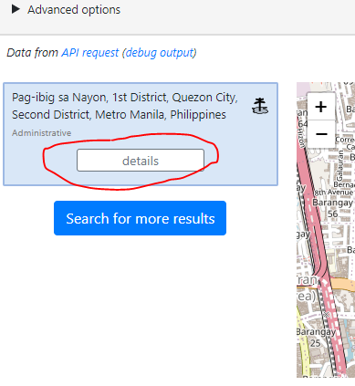
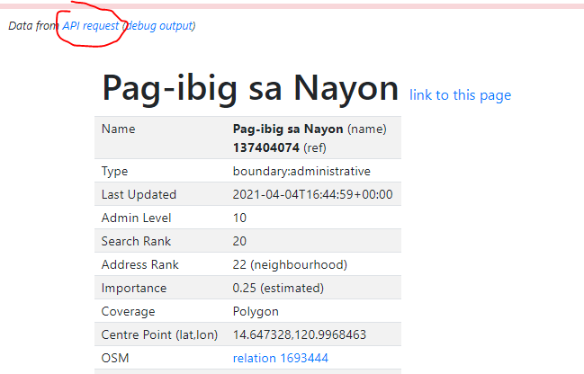

# CWTS Map

> Web app for saving Google Maps coordinates to Google Sheets.

Website link: [cwts-map.netlify.app](https://cwts-map.netlify.app)

1. Save coordinates in two clicks.
2. Supports feature identification ( tree, shrub, others )
3. Display feature markers 🌳
4. Display boundary lines 🗺
5. Compatible with the previous [chrome extension](https://github.com/JustroX/cwts-extension)

# Why?

It saves time.

# Getting Started

1. Create Spreadsheet

   - **IMPORTANT:** Add header rows (`Latitude`,`Longitude`,etc.)

   

   - Share the sheet to the extension server's email (`hatchling@evident-wind-286216.iam.gserviceaccount.com`)
   - Copy the sheet ID (from the URL)
     `https://docs.google.com/spreadsheets/d/{SHEET_ID_HERE}/edit#gid=0`

2. Start working

   - Input sheet ID

     

   - Navigate the map to your assigned location. You can use the pan controls.

     

   - Right click on a point and select the feature type.

     

3. Tada 🎉

   - If the coordinates were saved successfully the markers will be displayed.

     

     

# How to add bounday lines?

1. Go to [openstreetmap.org](https://nominatim.openstreetmap.org/)
2. Search your assigned location

   

3. Click details

   

4. Click **API request**

   

5. Copy the whole metadata

   

6. Paste the metadata to the web app text area named **Boundary Data**

   

7. Click show boundary and if there's no error the boundary will be displayed

   

# Contribute

- Fork repo and open PR
- Give stars ⭐
